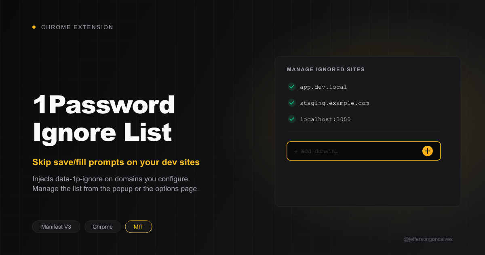

# 1Password Ignore List

Chrome extension (Manifest V3) that injects `data-1p-ignore` / `data-op-ignore` on the `<body>` of sites you configure, so 1Password stops offering to save or fill on them. Useful for local dev domains where 1Password's prompts get in the way.

## Install

1. Open `chrome://extensions`
2. Enable **Developer mode** (top right)
3. Click **Load unpacked**
4. Select this folder

## How it works

`content.js` runs at `document_start` (all frames) and checks the page's hostname against a domain list stored in `chrome.storage.sync`. On a match it sets `data-1p-ignore` and `data-op-ignore` on `<body>`, which the 1Password extension respects to skip save/fill prompts on that page. Matching includes subdomains (`example.test` also matches `app.example.test`).

Two ways to manage the list:

- **Popup** — quick toggle to ignore/un-ignore the current tab's domain, plus the full list with remove buttons.
- **Options page** (`chrome.runtime.openOptionsPage()`, or "Manage all →" in the popup) — add a single domain, bulk-add many (one per line), and remove entries from a table.

## Files

| File | Purpose |
|---|---|
| `manifest.json` | MV3 config |
| `content.js` | Injects the ignore attributes on matching domains |
| `popup.html` / `popup.js` | Quick toggle + list |
| `options.html` / `options.js` | Full management page (single add, bulk add, remove) |
